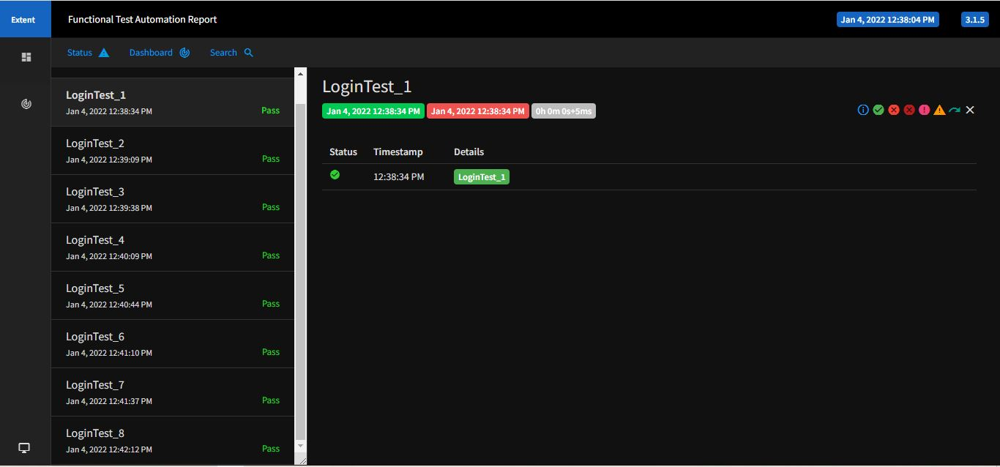
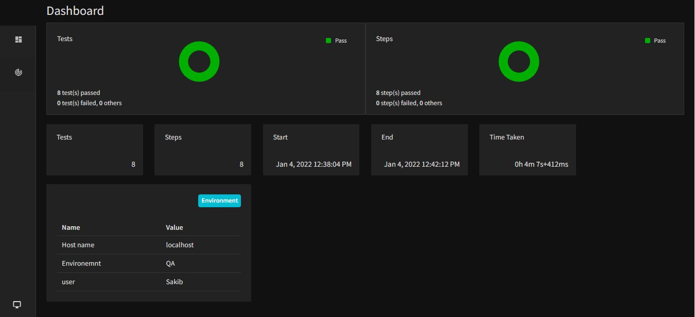

# Any_Do_Web_Automation
## Technology:
- Tool: selenium
- IDE: Eclipse
- Build Tool: Maven
- Language: Java
- Framework: TestNG
## Requirement:
1. Navigate to an https://desktop.any.do/ site
2. Register a user account with unique email and password
3. Login to user account
4. Now try login with registered email and password and add information
## Prerequisite:
1. Need to install jdk 1.8
2. Need good internet connectivity
## Run the automation script:
1. Open cmd to the project folder
2. Type this command:

```sh
C:\Users\SAKIB\Desktop\Java\Any_Do_Web
mvn clean install
```
3. Selenium will open the browser and start automation.
### <center><h2>Screenshots</h2></center>  
### Extent-Report:  


         

